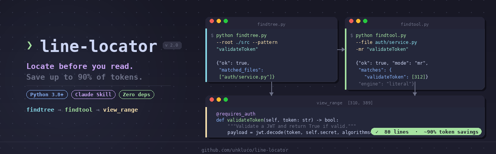
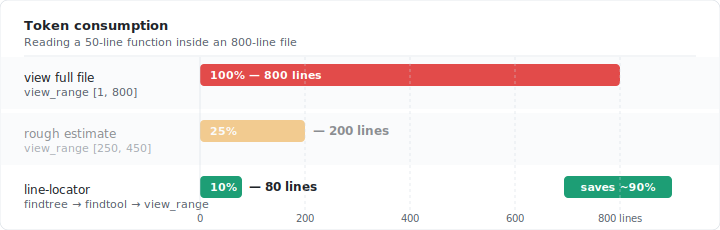
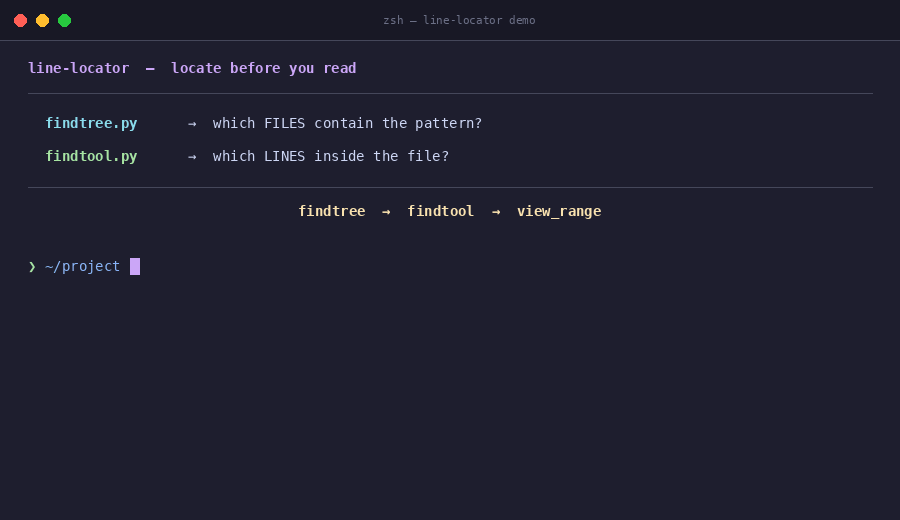
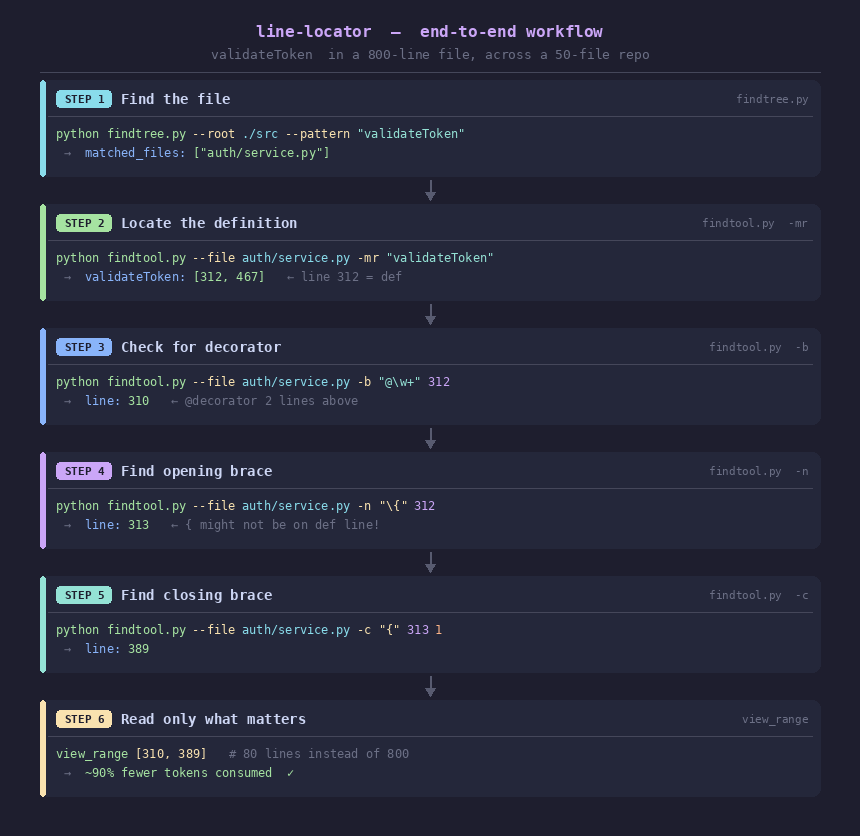

<div align="center">



# 🔍 line-locator

**A Claude skill that teaches your agent to navigate code like a senior dev — not a first-day intern.**

[](./SKILL.md)
[](https://python.org)
[](./LICENSE)
[](https://claude.ai)
[](#benchmarks)

*Stop reading 800 lines to find a 50-line function.*

</div>

---

## The Problem

When Claude needs to read or edit a function in your codebase, the default behavior is costly:

```
❌ Without line-locator              ✅ With line-locator
─────────────────────────────        ──────────────────────────────────
view_range [1, 800]                  findtree → "auth/service.py"
                                     findtool -mr "validateToken" → [312]
  (reads the entire file)            findtool -n "{" 312 → [313]
                                     findtool -c "{" 313 → [389]
                                     view_range [310, 389]

  800 lines consumed                 80 lines consumed   ← 90% savings
```

line-locator gives Claude a **surgical locate-then-read** workflow instead of brute-force full-file reads. The result: faster responses, lower cost, and fewer context-window blowouts on large repos.

---

## How it Works

```
┌─────────────────────────────────────────────────────────────────┐
│                     line-locator workflow                       │
│                                                                 │
│   "Find validateToken   ┌──────────────┐   Which files?         │
│    and read it."   ───► │  findtree.py │ ──────────────────►    │
│                         │  (folder)    │   auth/service.py      │
│                         └──────────────┘        │               │
│                                                 ▼               │
│                         ┌──────────────┐   Line 312 (def)       │
│                         │  findtool.py │ ◄──────────────────    │
│                         │  (file)      │   Line 313 ({)         │
│                         └──────────────┘   Line 389 (})         │
│                                 │                               │
│                                 ▼                               │
│                        view_range [310, 389]                    │
│                        (only 80 lines, not 800)                 │
└─────────────────────────────────────────────────────────────────┘
```

Two scripts. One purpose: **locate before you read.**

| Script | Scope | Answers |
|---|---|---|
| `findtree.py` | Entire directory tree | *Which files* contain this pattern? |
| `findtool.py` | Single file | *Which lines* in this file? |

---

## Benchmarks

Token consumption on a real-world 800-line `AuthService` with a 50-line target function:





Savings scale with file size. On a 3000-line service file:

| Task | Without | With | Saved |
|---|---|---|---|
| Read one function | ~3000 lines | ~60 lines | **98%** |
| Read 3 functions | ~3000 lines | ~200 lines | **93%** |
| Find a symbol across 50 files | all files | target file only | **varies** |

---

## Features

- **🌲 Tree-level search** — `findtree.py` scans a whole repo and returns matching file paths. Respects `.git`, `node_modules`, `__pycache__` and other bulky dirs automatically.
- **📍 File-level precision** — `findtool.py` returns exact line numbers for patterns, next/prev matches, delimiter pairs, and existence checks.
- **🤖 Agent-first JSON output** — both tools emit compact JSON by default. No parsing gymnastics.
- **⚡ Smart engine selection** — `auto` mode picks the fast literal engine for plain strings and regex only when needed.
- **🧠 Comment-aware delimiters** — `{` / `(` / `[` matching ignores occurrences inside strings and comments (`//`, `#`, `/* */`, triple-quotes, backticks).
- **🔒 Zero dependencies** — pure Python 3.8+, no pip install needed.

---

## Quick Start

### 1. Install the skill

```bash
git clone https://github.com/unkluco/line-locator.git
```

Add to your Claude skill path (typically `~/.claude/skills/`):

```bash
cp -r line-locator ~/.claude/skills/
```

### 2. Verify the scripts work

```bash
python line-locator/scripts/findtool.py --file your_file.py -mr "main"
# {"ok": true, "mode": "mr", "result": {"matches": {"main": [42]}}, "engine": "literal", "ignore_case": false}

python line-locator/scripts/findtree.py --root ./src --pattern "TODO"
# {"ok": true, "engine": "literal", "matched_files": ["src/app.py", "src/utils.py"]}
```

### 3. Ask Claude to use it

> *"Find the `processOrder` function in this repo and explain what it does."*

Claude will now use `findtree` + `findtool` to locate the function before reading — instead of opening every file.

---

## Usage

### findtree — find files

```bash
python findtree.py --root ROOT --pattern PATTERN [options]
```

```bash
# Find files containing a symbol
python findtree.py --root ./src --pattern "processOrder"

# Regex search — files with any class ending in "Service"
python findtree.py --root ./src --pattern "class\s+\w+Service" --engine regex

# Only search .py files, skip tests/
python findtree.py --root . --pattern "TODO" --include "*.py" --exclude "tests/**"

# Stop after the first match (fast existence check)
python findtree.py --root . --pattern "deprecated_api" --max-results 1
```

Output:
```json
{"ok": true, "engine": "literal", "matched_files": ["src/order.py", "src/order_utils.py"]}
```

---

### findtool — find lines

```bash
python findtool.py --file FILE FLAG [options]
```

| Flag | What it does | Output |
|---|---|---|
| `-mr PAT [PAT ...]` | All line numbers matching one or more patterns | `{"matches": {"pat": [1, 5, 12]}}` |
| `-n PAT LINE` | First match **after** LINE (0 = start of file) | `{"line": 45}` |
| `-b PAT LINE` | Last match **before** LINE (999999 = end of file) | `{"line": 12}` |
| `-e PAT` | Does any line match? | `{"matched": true}` |
| `-c OPEN LINE N` | Line of the Nth closing delimiter on LINE | `{"line": 89}` |
| `-o CLOSE LINE N` | Line of the Nth opening delimiter on LINE | `{"line": 34}` |

```bash
# Locate a function and its body
python findtool.py --file app.py -mr "processOrder"
# → line 247

python findtool.py --file app.py -n "\{" 247
# → line 248  (the actual opening brace, wherever it lands)

python findtool.py --file app.py -c "{" 248 1
# → line 298  (the matching closing brace)

# view_range [247, 298]  ← only read what you need
```



---

## Real-world Example

**Task:** Read the `validateToken` method including its decorator, inside an 800-line file across a 50-file repo.

```bash
# 1. Find the file
python findtree.py --root ./src --pattern "validateToken"
# → {"matched_files": ["auth/service.py"]}

# 2. Find the definition line
python findtool.py --file auth/service.py -mr "validateToken"
# → {"matches": {"validateToken": [312, 467]}}   ← 312 = def, 467 = call site

# 3. Check for a decorator just above
python findtool.py --file auth/service.py -b "@\w+" 312
# → {"line": 310}   ← decorator is 2 lines above, include it

# 4. Find the opening brace (might not be on the same line as def)
python findtool.py --file auth/service.py -n "\{" 312
# → {"line": 313}

# 5. Find the closing brace
python findtool.py --file auth/service.py -c "{" 313 1
# → {"line": 389}

# 6. Read only what matters
view_range [310, 389]   # 80 lines instead of 800
```



---

## Why Not Just Use `grep`?

Good question. `grep` is powerful, but it's not shaped for agent use:

| | `grep` | `line-locator` |
|---|---|---|
| Output format | Human text | **JSON (agent-ready)** |
| Delimiter matching | ❌ | **✅ with comment awareness** |
| Find closing brace | ❌ | **✅ `-c "{"` in one call** |
| Next/prev boundary | Awkward | **✅ `-n` / `-b`** |
| Literal search without escaping | Partial (`-F`) | **✅ `--engine literal`** |
| File-level + folder-level | Two separate tools | **✅ unified design** |
| Error format | Exit code + text | **✅ `{"ok": false, "error": "..."}` always** |

`grep` is great for humans at a terminal. `line-locator` is designed for agents that parse output and chain calls.

---

## JSON Output Contract

All output is compact, single-line JSON. Errors go to `stderr` with `"ok": false`.

```jsonc
// findtool success
{"ok": true, "mode": "mr",     "result": {"matches": {"fn": [12, 47]}}, "engine": "literal", "ignore_case": false}
{"ok": true, "mode": "n",      "result": {"line": 48}}
{"ok": true, "mode": "b",      "result": {"line": 11}}
{"ok": true, "mode": "exists", "result": {"matched": true}}
{"ok": true, "mode": "c",      "result": {"line": 89}}

// findtree success
{"ok": true, "engine": "literal", "matched_files": ["src/order.py"]}

// any failure → stderr, exit 1
{"ok": false, "error": "No line matching pattern 'foo' was found after line 0."}
```

---

## Tips & Gotchas

**`{` might not be on the same line as the function name.**  
Two styles coexist in every language. Never assume — always use `-n "\{"` to find the real brace line:

```
# Style A — brace on same line       # Style B — brace on next line
processOrder(params) {               processOrder(params)
    ...                              {
}                                        ...
                                     }
```

**Use `--engine literal` to skip escaping.**  
Searching for `foo(bar)` or `[key]`? Don't fight regex escaping:

```bash
# ❌ regex (default) — need to escape
python findtool.py --file app.py -mr "foo\(bar\)"

# ✅ literal — no escaping
python findtool.py --file app.py --engine literal -mr "foo(bar)"
```

**`-b 999999` searches the whole file from the bottom.**  
Passing any value larger than the file length is silently clamped — `999999` is a safe sentinel for "from end of file."

---

## Project Structure

```
line-locator/
├── SKILL.md              ← Claude skill definition (load this into your skill path)
├── README.md             ← you are here
└── scripts/
    ├── findtool.py       ← file-level: line numbers, delimiters
    └── findtree.py       ← folder-level: which files match
```

---

## Contributing

Issues and PRs welcome. If you have a workflow that line-locator handles badly, open an issue with a minimal repro — language, file structure, and what you were trying to locate.

---

## License

MIT — see [LICENSE](./LICENSE).

---

<div align="center">

**If this saved you tokens, give it a ⭐**

Made for [Claude Skills](https://claude.ai) · by [@unkluco](https://github.com/unkluco)

</div>
